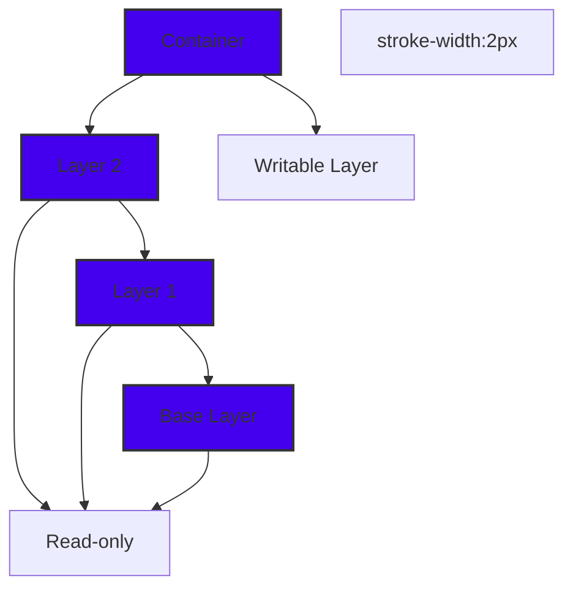
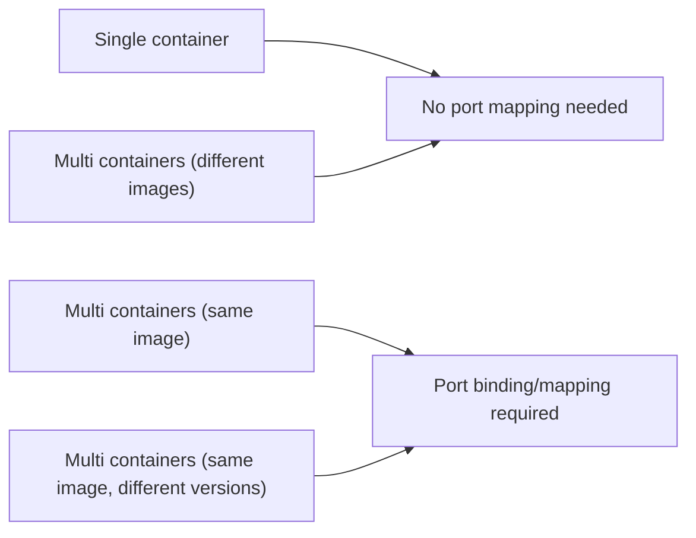

## Layers

**BASE layer** -> Gerneraly a small size **linux image** like daebian alpine 

## Port Binding

by default docker conatiners have a port which is binned to them. it also have a seperate virtual file system and it also as seperate port 

`docker run -p 8080:3306 <IMAGE_NAME`

Host machine ports and container ports are different in nature. Two containers running different versions of the same image can expose the same container port, but in reality they must be mapped to different host ports to avoid conflicts.

## When to do or don't need do mapping

## binding

command: `docker run -phostPort:containerPort <IMAGE_NAME>`
example: `docker run -p8080:3306 mysql`

## Trobleshoot command

* **logs command**: `docker logs <Container_id>` example: `docker logs 5f83e2537c21 `
* **exec command ** : it's allow us to run **additional commands** to run on an allready **running container **.

  command : `docker exec -it Cont_ID /bin/bash`
  command : `docker exec -it Const_ID /bin/sh`

 

